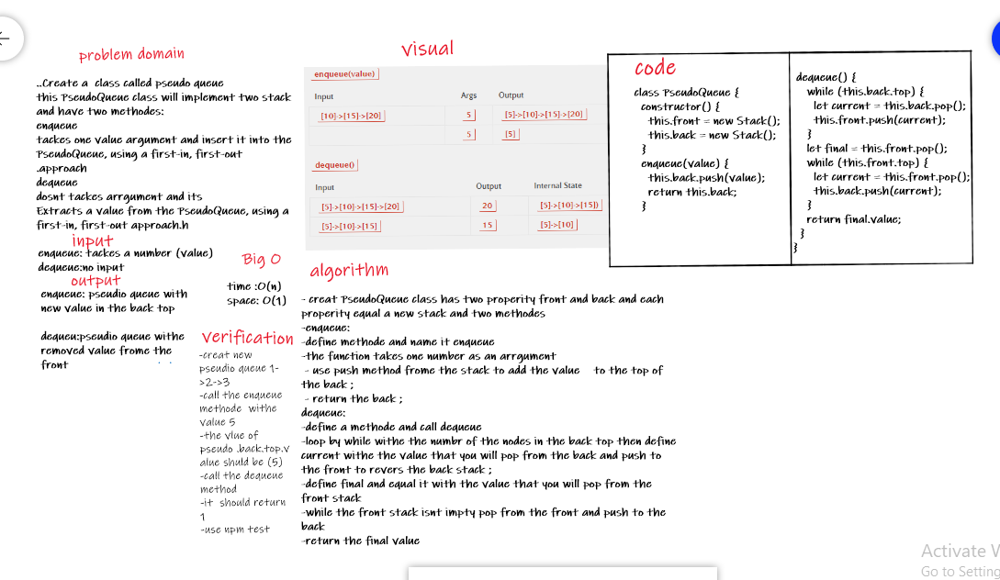

# Stacks and Queues

<!-- Short summary or background information -->

## Challenge

11

## Approach & Efficiency

I took the approach of minimizing big O space/time by keeping my functions simplistic and focused on only what was necessary to complete the task. Big O space is O(1) and time is O(n);

