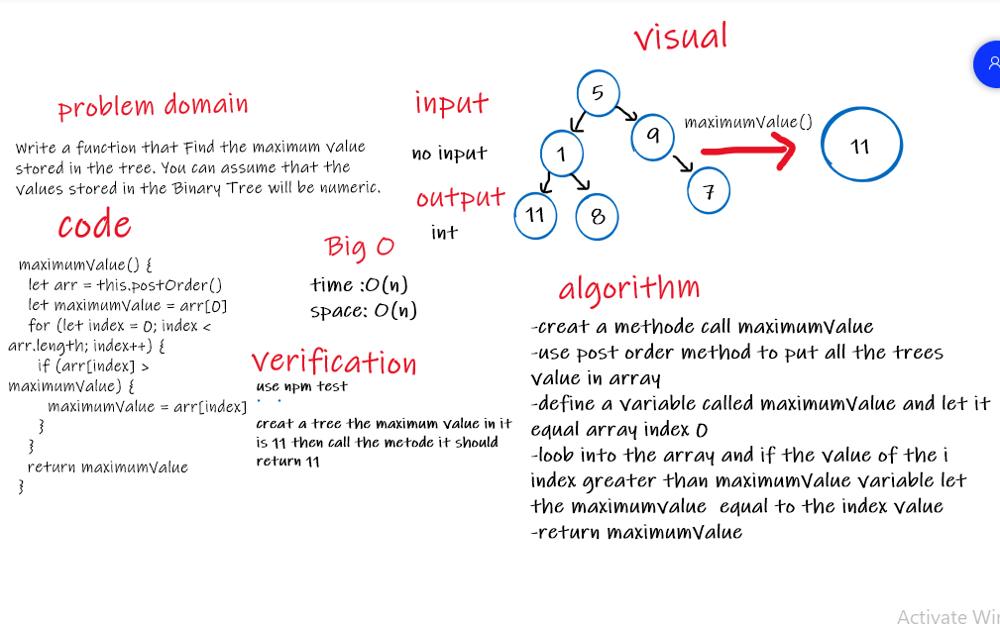
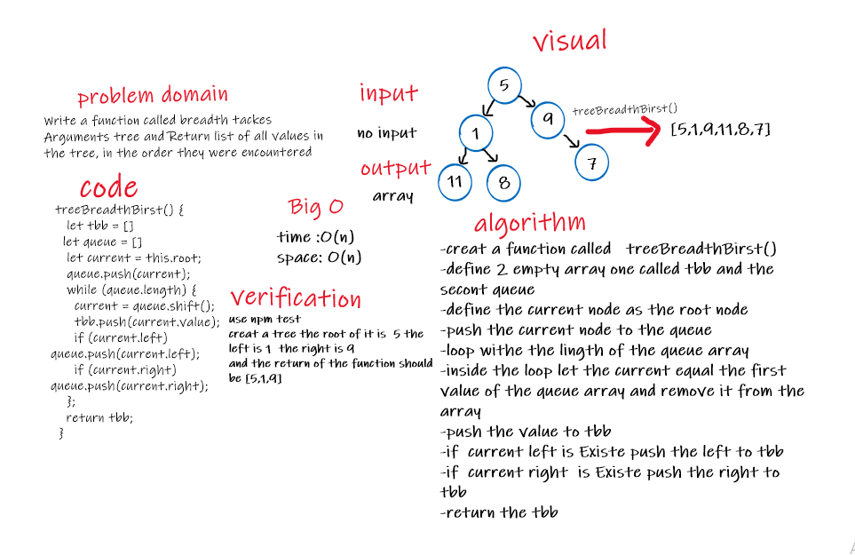
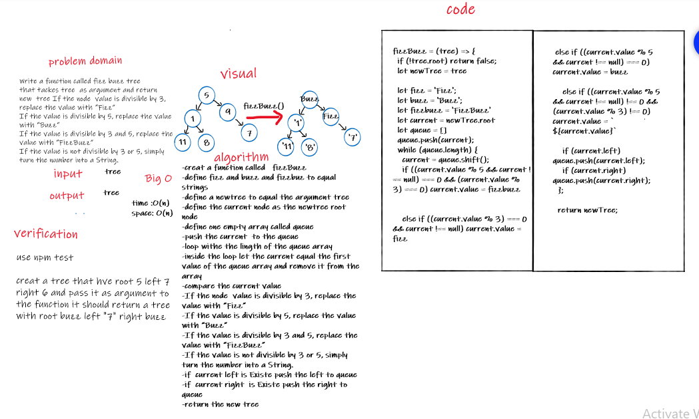

# Trees

Code Challenge 15 , 16 ,17 ,18

## Challenge 15

- Challenge 15: Create a Node class that has properties for the value stored in the node, the left child node, and the right child node , Create a Binary Tree class , Create a Binary Search Tree class
  <!-- Description of the challenge -->

  Big O space is O(n) and time is O(n);

### Binary Tree

Define a method:

- pre order
  - Returns: array
- in order
  - Returns: array
- post order
  - Returns: array

### Binary Search Tree

Define a method:

- pre order
  - Returns: array
- in order
  - Returns: array
- post order
  - Returns: array
- Add:

  - Challenge Arguments: value
  - Return: nothing

- Contains

  - Argument: value
  - Returns: boolean

## code challenge 16 :Find the Maximum Value in a Binary Tree

## code challenge 17: treeBreadthBirst

## code challenge 18: FizzBuzz

